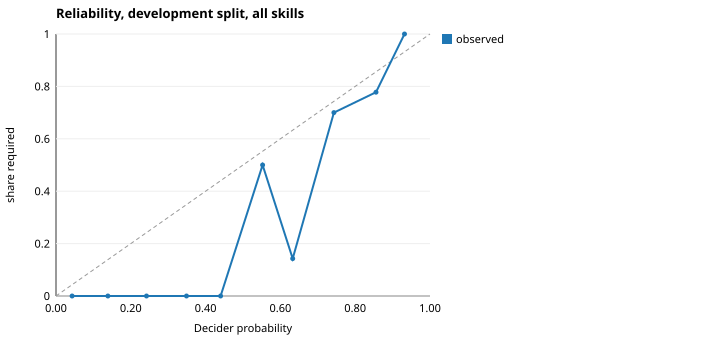
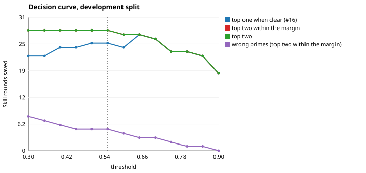

# Priming thresholds

Fitted on the Golden Set's **development split** (40 cases), which is used for nothing else. Published on the **held-out split** (40 cases), at the values the configuration ships: threshold **0.55**, margin **0.2**, rule *top two within the margin*.

## Results (held-out split)

| | Exact set | Precision | Recall | Skill rounds saved | Seconds saved | Decider time | Wrong primes | Missed |
|---|---|---|---|---|---|---|---|---|
| Shipped values | 80% | 93% | 91% | 18 of 22 | 54 s | 7 s | 4 (3,423 tokens) | 5 |
| Same answers, the rule before #18 (top one when clear, 0.55 / 0.15) | 68% | 94% | 75% | 14 of 22 | 45 s | 7 s | 3 (2,697 tokens) | 14 |
| Shipped values, the Decider's state before #18 (not told when the customer is a new prospect) | 80% | 93% | 91% | 18 of 22 | 54 s | 7 s | 4 (3,423 tokens) | 5 |
| Before #18: that rule and that state | 68% | 92% | 79% | 14 of 22 | 45 s | 7 s | 4 (3,423 tokens) | 12 |

A round counts as saved when every required skill was primed on a case whose baseline first response loaded skills and called nothing a skill informs; its seconds are that round's measured duration. The Decider's time is spent on every turn, saved or not. A missed prime costs the round Priming was meant to save; a wrong prime costs its body in tokens and some bias toward that area — which is what the quality check in step 3 is for.

**The rule.** At the shipped values the production rule saves 28 rounds on the development split and 18 held out; the rule before #18 saves 25 and 14.

**The state.** Told when the customer is a new prospect, the Decider saves 28 rounds on the development split against 26 without it, and 18 held out against 18.

## How the values were chosen (development split)

### 1. Calibration

Pooled over skills: 409 (case, skill) pairs, ECE 0.088. One log-odds shift shared by every skill fits at -1.10 — the Decider is over-confident overall. Leave-one-case-out log-loss: raw 0.133; the shared shift 0.093; a shift per skill around it 0.089 (+4.1% on the shared one). A shared shift changes no ranking — it is the same as moving the threshold, which is fitted below — so only the per-skill gain matters. It falls short of the 5% a per-skill parameter must earn, so the per-skill shifts in the table are what this many cases look like by chance: a probability is taken to mean the same for every skill, and no correction is applied.

| Skill | Pairs | Required | ECE | Its own shift (log-odds, around the shared one) |
|---|---|---|---|---|
| billing | 36 | 5 | 0.099 | -1.05 |
| connect | 36 | 6 | 0.102 | -1.01 |
| data | 39 | 6 | 0.082 | -0.57 |
| discovery | 36 | 6 | 0.055 | -0.54 |
| fraud_protection | 38 | 5 | 0.072 | -1.15 |
| objection_handling | 39 | 4 | 0.107 | -1.44 |
| payments | 33 | 7 | 0.254 | -1.52 |
| pricing_conversation | 35 | 5 | 0.133 | -1.52 |
| security_compliance | 40 | 4 | 0.177 | -1.64 |
| tax | 39 | 5 | 0.042 | -0.92 |
| terminal | 38 | 5 | 0.044 | -0.46 |

### 2. The decision curve

Each rule at its best margin per threshold:

| Rule | Threshold | Margin | Rounds saved | Seconds saved | Wrong primes | Missed | Exact |
|---|---|---|---|---|---|---|---|
| top one when clear (#16) | 0.30 | 0.05 | 22 of 31 | 74 s | 6 | 15 | 60% |
| top one when clear (#16) | 0.35 | 0.05 | 22 of 31 | 74 s | 5 | 14 | 65% |
| top one when clear (#16) | 0.40 | 0.05 | 24 of 31 | 80 s | 5 | 12 | 70% |
| top one when clear (#16) | 0.45 | 0.05 | 24 of 31 | 80 s | 4 | 12 | 72% |
| top one when clear (#16) | 0.50 | 0.05 | 25 of 31 | 82 s | 4 | 11 | 75% |
| top one when clear (#16) | 0.55 | 0.05 | 25 of 31 | 82 s | 4 | 11 | 75% |
| top one when clear (#16) | 0.60 | 0.05 | 24 of 31 | 80 s | 3 | 13 | 70% |
| top one when clear (#16) | 0.65 | 0.05 | 27 of 31 | 89 s | 2 | 10 | 80% |
| top one when clear (#16) | 0.70 | 0.05 | 26 of 31 | 85 s | 3 | 10 | 78% |
| top one when clear (#16) | 0.75 | 0.05 | 23 of 31 | 76 s | 2 | 14 | 70% |
| top one when clear (#16) | 0.80 | 0.05 | 23 of 31 | 76 s | 1 | 14 | 72% |
| top one when clear (#16) | 0.85 | 0.05 | 22 of 31 | 67 s | 1 | 15 | 70% |
| top one when clear (#16) | 0.90 | 0.05 | 18 of 31 | 53 s | 0 | 20 | 62% |
| top two within the margin | 0.30 | 0.35 | 28 of 31 | 91 s | 8 | 3 | 75% |
| top two within the margin | 0.35 | 0.35 | 28 of 31 | 91 s | 7 | 3 | 78% |
| top two within the margin | 0.40 | 0.35 | 28 of 31 | 91 s | 6 | 3 | 80% |
| top two within the margin | 0.45 | 0.35 | 28 of 31 | 91 s | 5 | 3 | 82% |
| top two within the margin | 0.50 | 0.20 | 28 of 31 | 91 s | 5 | 3 | 82% |
| top two within the margin | 0.55 | 0.20 | 28 of 31 | 91 s | 5 | 3 | 82% |
| top two within the margin | 0.60 | 0.20 | 27 of 31 | 89 s | 4 | 5 | 78% |
| top two within the margin | 0.65 | 0.05 | 27 of 31 | 89 s | 3 | 6 | 80% |
| top two within the margin | 0.70 | 0.05 | 26 of 31 | 85 s | 3 | 7 | 78% |
| top two within the margin | 0.75 | 0.05 | 23 of 31 | 76 s | 2 | 11 | 70% |
| top two within the margin | 0.80 | 0.05 | 23 of 31 | 76 s | 1 | 11 | 72% |
| top two within the margin | 0.85 | 0.05 | 22 of 31 | 67 s | 1 | 13 | 70% |
| top two within the margin | 0.90 | 0.05 | 18 of 31 | 53 s | 0 | 18 | 62% |
| top two | 0.30 | 0.00 | 28 of 31 | 91 s | 8 | 3 | 75% |
| top two | 0.35 | 0.00 | 28 of 31 | 91 s | 7 | 3 | 78% |
| top two | 0.40 | 0.00 | 28 of 31 | 91 s | 6 | 3 | 80% |
| top two | 0.45 | 0.00 | 28 of 31 | 91 s | 5 | 3 | 82% |
| top two | 0.50 | 0.00 | 28 of 31 | 91 s | 5 | 3 | 82% |
| top two | 0.55 | 0.00 | 28 of 31 | 91 s | 5 | 3 | 82% |
| top two | 0.60 | 0.00 | 27 of 31 | 89 s | 4 | 5 | 78% |
| top two | 0.65 | 0.00 | 27 of 31 | 89 s | 3 | 5 | 80% |
| top two | 0.70 | 0.00 | 26 of 31 | 85 s | 3 | 6 | 78% |
| top two | 0.75 | 0.00 | 23 of 31 | 76 s | 2 | 10 | 70% |
| top two | 0.80 | 0.00 | 23 of 31 | 76 s | 1 | 11 | 72% |
| top two | 0.85 | 0.00 | 22 of 31 | 67 s | 1 | 13 | 70% |
| top two | 0.90 | 0.00 | 18 of 31 | 53 s | 0 | 18 | 62% |

### 3. Quality on the behaviour cases

| Run | Priming | First action | Judge mean | Leak-free | Errors | Turns primed | Tool rounds | Turn p50 | Turn p90 | Within noise |
|---|---|---|---|---|---|---|---|---|---|---|
| behaviour-off-a | off | 100% | 4.26 | 19/19 | 0 | 0/25 | 44 | 12.6 s | 25.7 s | baseline |
| behaviour-off-b | off | 100% | 4.37 | 19/19 | 0 | 0/25 | 41 | 12.8 s | 21.8 s | baseline |
| behaviour-t045 | 0.45 / 0.2 | 100% | 4.18 (-0.13) | 19/19 | 0 | 20/25 | 29 (-14) | 10.2 s (-2.5) | 25.6 s (+1.8) | ✓ |
| behaviour-t055 | 0.55 / 0.2 | 100% | 4.58 (+0.26) | 19/19 | 0 | 19/25 | 28 (-14) | 11.3 s (-1.4) | 27.0 s (+3.3) | ✓ |
| behaviour-t065 | 0.65 / 0.2 | 100% | 4.24 (-0.08) | 19/19 | 0 | 18/25 | 25 (-18) | 9.9 s (-2.8) | 27.7 s (+3.9) | ✓ |

Changes are against the mean of the 2 runs with Priming off. Noise: 5% of first-action accuracy and 0.20 of the judge's mean — their spread, or one case and 0.20 (about one standard error of a nineteen-case mean) if they agreed more closely. Between those two runs turn p50 moved 0.3 s and turn p90 3.9 s, so latency differences smaller than that say nothing. A skill Priming put in counts as a first action, so first-action accuracy here says whether the right skill got in first; the judge says what the model then did with it.

### 4. The choice

Quality within noise at 0.45 / 0.2, 0.55 / 0.2, 0.65 / 0.2. Among those, the curve's best point is threshold 0.55, margin 0.2: 28 of 31 Skill rounds saved on the development split, with 5 wrong primes and 3 missed. **These are the shipped values.**

No setting without a behaviour run ranks above this point on the curve, so running more could not change the choice: every other threshold saves fewer rounds, or as many with more wrong primes.

The margin is read off the same curve. At threshold 0.55, margins 0.20, 0.25, 0.30, 0.35, 0.40 do equally well on the development split; the smallest primes a second skill least often, so it is the one the behaviour runs used.
